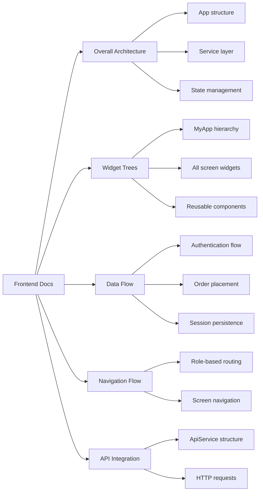
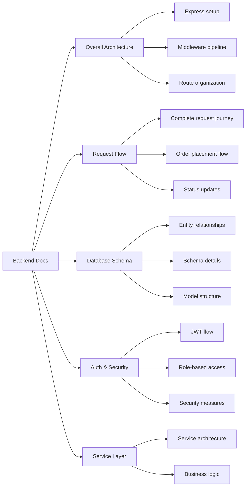
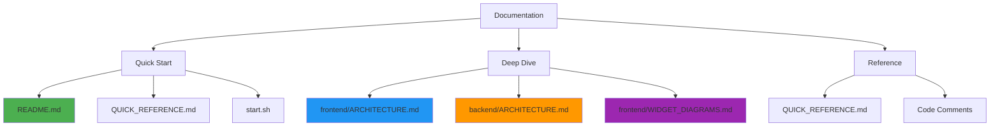

# 📚 Documentation Index

Welcome! This project has comprehensive documentation with visual diagrams. Here's where to find everything.

---

## 🚀 Getting Started (Start Here!)

### 1. Quick Start
- **[README.md](README.md)** - Main project overview
- **[QUICK_REFERENCE.md](QUICK_REFERENCE.md)** - Common commands & API endpoints
- **[start.sh](start.sh)** - Run backend + frontend together

### 2. First Time Setup

```bash
# 1. Backend setup
cd backend
npm install
# Create .env file (see backend/ARCHITECTURE.md)
npm start

# 2. Frontend setup
cd frontend
flutter pub get
flutter run -d chrome

# OR use the script
./start.sh
```

### 3. Backend URLs

**Production (Already Deployed):**
- Backend API: `https://food-fc4q.onrender.com`
- Frontend is configured to use this production URL

**Local Development:**
- Backend runs on: `http://localhost:5001`
- Update `frontend/lib/services/api_service.dart` to point to local URL if testing locally

---

## 📖 Complete Documentation

### 🎯 Main Documentation

| Document | What's Inside | When to Read |
|----------|--------------|--------------|
| **[README.md](README.md)** | Complete project overview, tech stack, features | First thing to read |
| **[QUICK_REFERENCE.md](QUICK_REFERENCE.md)** | Quick commands, API list, troubleshooting | Daily reference |
| **[frontend/ARCHITECTURE.md](frontend/ARCHITECTURE.md)** | Complete frontend architecture with diagrams | Understanding Flutter app |
| **[backend/ARCHITECTURE.md](backend/ARCHITECTURE.md)** | Complete backend architecture with diagrams | Understanding Node.js API |
| **[frontend/WIDGET_DIAGRAMS.md](frontend/WIDGET_DIAGRAMS.md)** | Every widget tree visualized | Building UI components |

---

## 🎨 Visual Diagrams Guide

### Frontend Diagrams (in ARCHITECTURE.md & WIDGET_DIAGRAMS.md)



### Backend Diagrams (in ARCHITECTURE.md)



---

## 🗂️ Documentation by Topic

### For Learning the Project

1. **Start with**: [README.md](README.md) - Get the big picture
2. **Then read**: [QUICK_REFERENCE.md](QUICK_REFERENCE.md) - Learn commands
3. **Deep dive**: 
   - Frontend: [frontend/ARCHITECTURE.md](frontend/ARCHITECTURE.md)
   - Backend: [backend/ARCHITECTURE.md](backend/ARCHITECTURE.md)

### For Building Features

1. **Frontend**: [frontend/WIDGET_DIAGRAMS.md](frontend/WIDGET_DIAGRAMS.md) - See widget structures
2. **Backend**: [backend/ARCHITECTURE.md](backend/ARCHITECTURE.md) - See API patterns
3. **Reference**: [QUICK_REFERENCE.md](QUICK_REFERENCE.md) - API endpoints

### For Understanding Flow

1. **User Journey**: [README.md](README.md) - Role-based features
2. **Data Flow**: [frontend/ARCHITECTURE.md](frontend/ARCHITECTURE.md) - See sequence diagrams
3. **API Flow**: [backend/ARCHITECTURE.md](backend/ARCHITECTURE.md) - Request pipeline

### For Debugging

1. **Quick fixes**: [QUICK_REFERENCE.md](QUICK_REFERENCE.md) - Common issues
2. **Frontend issues**: [frontend/ARCHITECTURE.md](frontend/ARCHITECTURE.md) - State management
3. **Backend issues**: [backend/ARCHITECTURE.md](backend/ARCHITECTURE.md) - Error handling

---

## 📁 File Structure Reference

### Frontend Files
```
frontend/
├── ARCHITECTURE.md          ⭐ Complete frontend architecture
├── WIDGET_DIAGRAMS.md      ⭐ All widget trees visualized
├── README.md               ℹ️ Basic Flutter readme
├── lib/
│   ├── main.dart          🎯 App entry point
│   ├── models/            📊 Data structures
│   ├── services/          🔌 API communication
│   ├── screens/           📱 All UI screens
│   ├── widgets/           🧩 Reusable components
│   └── constants/         ⚙️ App settings
```

### Backend Files
```
backend/
├── ARCHITECTURE.md         ⭐ Complete backend architecture
├── README.md              ℹ️ Basic backend readme
├── src/
│   ├── server.js         🎯 Entry point
│   ├── app.js            ⚙️ Express setup
│   ├── models/           📊 MongoDB schemas
│   ├── routes/           🛣️ API endpoints
│   ├── controllers/      📞 Request handlers
│   ├── services/         💼 Business logic
│   └── middlewares/      🛡️ Auth & protection
```

---

## 🎯 Quick Navigation by Role

### I'm a Developer Learning This Project

**Read in this order:**
1. [README.md](README.md) - Overview
2. [frontend/ARCHITECTURE.md](frontend/ARCHITECTURE.md) - Frontend details
3. [backend/ARCHITECTURE.md](backend/ARCHITECTURE.md) - Backend details
4. [frontend/WIDGET_DIAGRAMS.md](frontend/WIDGET_DIAGRAMS.md) - Widget reference
5. Code comments (all in simple English!)

### I'm Building a Feature

**Your toolkit:**
- [QUICK_REFERENCE.md](QUICK_REFERENCE.md) - API endpoints
- [frontend/WIDGET_DIAGRAMS.md](frontend/WIDGET_DIAGRAMS.md) - Widget patterns
- [backend/ARCHITECTURE.md](backend/ARCHITECTURE.md) - Service patterns

### I'm Debugging an Issue

**Check:**
1. [QUICK_REFERENCE.md](QUICK_REFERENCE.md) - Common issues
2. Console/Terminal output
3. [backend/ARCHITECTURE.md](backend/ARCHITECTURE.md) - Error handling
4. Code comments for context

### I'm Setting Up the Project

**Steps:**
1. [README.md](README.md) - Prerequisites
2. Backend `.env` setup (see [backend/ARCHITECTURE.md](backend/ARCHITECTURE.md))
3. Run `./start.sh` from project root
4. Check [QUICK_REFERENCE.md](QUICK_REFERENCE.md) for troubleshooting

---

## 📊 What Each Document Contains

### README.md (Main)
- ✅ Project overview with diagrams
- ✅ Complete user flows
- ✅ Role-based features
- ✅ Tech stack
- ✅ Installation steps
- ✅ Database models
- ✅ Security features

### QUICK_REFERENCE.md
- ✅ All commands
- ✅ API endpoint list
- ✅ cURL examples
- ✅ Common issues
- ✅ Port numbers
- ✅ File locations

### frontend/ARCHITECTURE.md
- ✅ Complete architecture diagrams
- ✅ Widget tree structures
- ✅ Data flow diagrams
- ✅ State management
- ✅ API service breakdown
- ✅ Navigation flows
- ✅ Screen compositions

### backend/ARCHITECTURE.md
- ✅ Complete architecture diagrams
- ✅ Request flow pipelines
- ✅ Database ERD
- ✅ JWT authentication flow
- ✅ Service layer patterns
- ✅ Order lifecycle
- ✅ API endpoint details

### frontend/WIDGET_DIAGRAMS.md
- ✅ MyApp widget tree
- ✅ Every screen widget tree
- ✅ Reusable component trees
- ✅ Layout patterns
- ✅ Theme structure
- ✅ State management patterns
- ✅ Navigation map

---

## 🔍 Search by Keyword

**Authentication:**
- Frontend: [frontend/ARCHITECTURE.md](frontend/ARCHITECTURE.md) → Authentication Flow
- Backend: [backend/ARCHITECTURE.md](backend/ARCHITECTURE.md) → JWT Token Flow
- Diagrams: Both files have sequence diagrams

**Orders:**
- Frontend: [frontend/ARCHITECTURE.md](frontend/ARCHITECTURE.md) → Order Placement Flow
- Backend: [backend/ARCHITECTURE.md](backend/ARCHITECTURE.md) → Order Lifecycle
- API: [QUICK_REFERENCE.md](QUICK_REFERENCE.md) → Orders section

**Widgets:**
- [frontend/WIDGET_DIAGRAMS.md](frontend/WIDGET_DIAGRAMS.md) → All widget trees
- [frontend/ARCHITECTURE.md](frontend/ARCHITECTURE.md) → UI Components

**Database:**
- [backend/ARCHITECTURE.md](backend/ARCHITECTURE.md) → Database Schema Architecture
- [README.md](README.md) → Database Models section

**Roles:**
- [README.md](README.md) → User Roles & Features
- [backend/ARCHITECTURE.md](backend/ARCHITECTURE.md) → Role-Based Access Control

---

## 🎨 Mermaid Diagrams Overview

All documentation uses Mermaid for visual diagrams. They render automatically on GitHub and many Markdown viewers.

**Diagram Types Used:**

| Type | Used For | Found In |
|------|----------|----------|
| `graph TB/LR` | Architecture, flows | All docs |
| `sequenceDiagram` | Request flows, API calls | Architecture docs |
| `stateDiagram` | Navigation, order status | README, Architecture |
| `erDiagram` | Database relationships | Backend Architecture |
| `classDiagram` | Service structure | Backend Architecture |

---

## 📝 Code Comments

All code (frontend & backend) has **simple English comments** explaining:
- What each part does
- Why it exists
- How it works

**Example:**
```dart
// Save user data to local storage so they stay logged in
// This runs after successful login
await StorageHelper.saveUser(user);
```

---

## 🆘 Help & Support

### Can't Find Something?

1. Check this index
2. Search in [README.md](README.md)
3. Look in [QUICK_REFERENCE.md](QUICK_REFERENCE.md)
4. Check architecture docs for your area

### Common Questions

**Q: How do I run the project?**  
A: See [README.md](README.md) → Installation or run `./start.sh`

**Q: Where are the API endpoints?**  
A: [QUICK_REFERENCE.md](QUICK_REFERENCE.md) → API Endpoints

**Q: How does authentication work?**  
A: [backend/ARCHITECTURE.md](backend/ARCHITECTURE.md) → JWT Token Flow

**Q: What widgets are used?**  
A: [frontend/WIDGET_DIAGRAMS.md](frontend/WIDGET_DIAGRAMS.md) → All widget trees

**Q: How do orders work?**  
A: [backend/ARCHITECTURE.md](backend/ARCHITECTURE.md) → Order Lifecycle

---

## 🎯 Documentation Summary



---

**Happy Coding! 🚀**