# Frontend Architecture Documentation

## 📱 Food Order App - Flutter Frontend

A comprehensive Flutter application for food ordering with role-based access for Users, Restaurants, and Admins.

---

## 🏗️ Architecture Overview

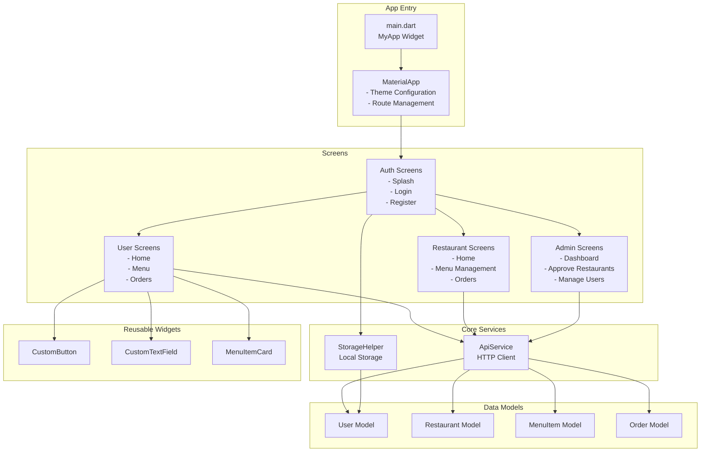

---

## 🎯 Widget Tree Structure

### Main App Widget Hierarchy

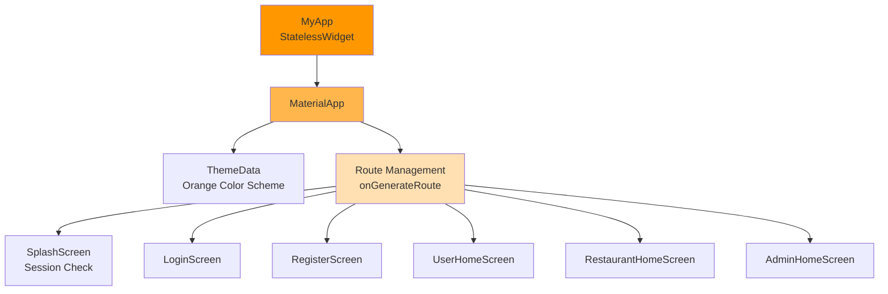

### Typical Screen Structure

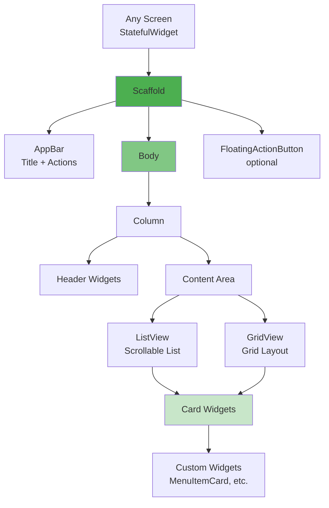

---

## 📂 Project Structure

```
frontend/
├── lib/
│   ├── main.dart                    # App entry point, routing configuration
│   │
│   ├── constants/                   # App-wide constants
│   │   ├── app_constants.dart       # Static values, colors, roles
│   │   └── categories.dart          # Food categories list
│   │
│   ├── models/                      # Data structures
│   │   ├── user.dart                # User model with JSON parsing
│   │   ├── restaurant.dart          # Restaurant model
│   │   ├── menu_item.dart           # Food item model
│   │   └── order.dart               # Order and OrderItem models
│   │
│   ├── services/                    # Business logic & API calls
│   │   └── api_service.dart         # All backend HTTP requests
│   │
│   ├── utils/                       # Helper utilities
│   │   └── storage_helper.dart      # Local data persistence
│   │
│   ├── screens/                     # All UI screens
│   │   ├── auth/                    # Authentication screens
│   │   │   ├── splash_screen.dart   # Initial loading & session check
│   │   │   ├── login_screen.dart    # User login
│   │   │   └── register_screen.dart # New user registration
│   │   │
│   │   ├── user/                    # Customer screens
│   │   │   ├── user_home_screen.dart        # Browse restaurants/menu
│   │   │   ├── restaurant_menu_screen.dart  # View specific restaurant
│   │   │   └── my_orders_screen.dart        # Order history
│   │   │
│   │   ├── restaurant/              # Restaurant owner screens
│   │   │   ├── restaurant_home_screen.dart  # Owner dashboard
│   │   │   ├── manage_menu_screen.dart      # Add/edit menu items
│   │   │   └── restaurant_orders_screen.dart # Incoming orders
│   │   │
│   │   └── admin/                   # Admin screens
│   │       └── admin_home_screen.dart # Admin dashboard
│   │
│   └── widgets/                     # Reusable UI components
│       ├── custom_button.dart       # Styled button widget
│       ├── custom_textfield.dart    # Input field widget
│       └── menu_item_card.dart      # Food item display card
│
├── pubspec.yaml                     # Dependencies & assets
└── web/                            # Web platform specific files
```

---

## 🔄 Data Flow Architecture

### Authentication Flow

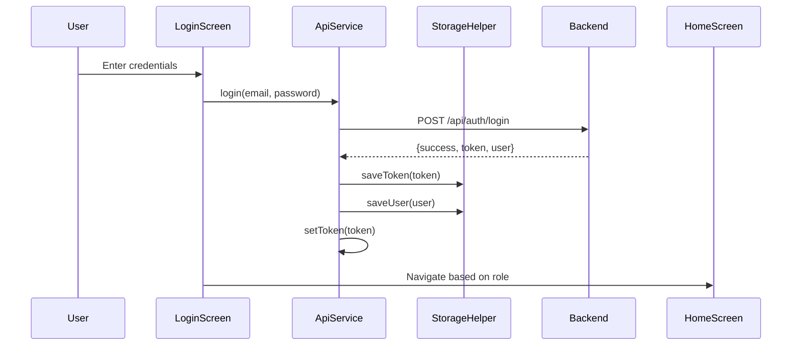

### Order Placement Flow

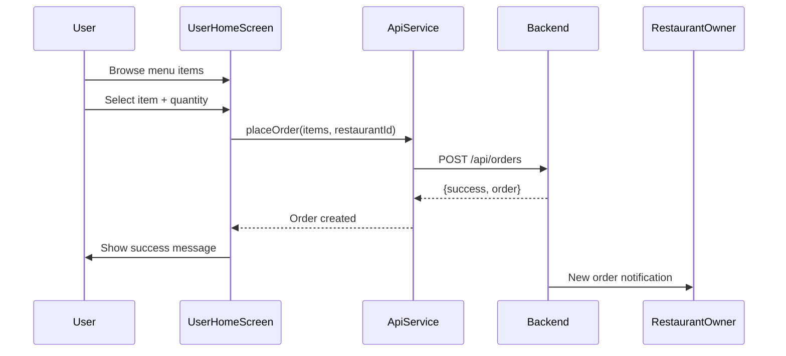

### Session Persistence Flow

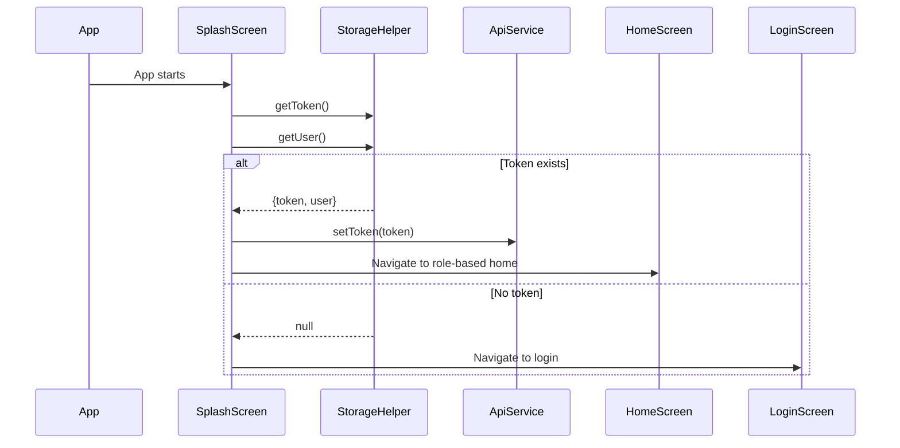

---

## 🎨 UI Components Breakdown

### LoginScreen Widget Tree

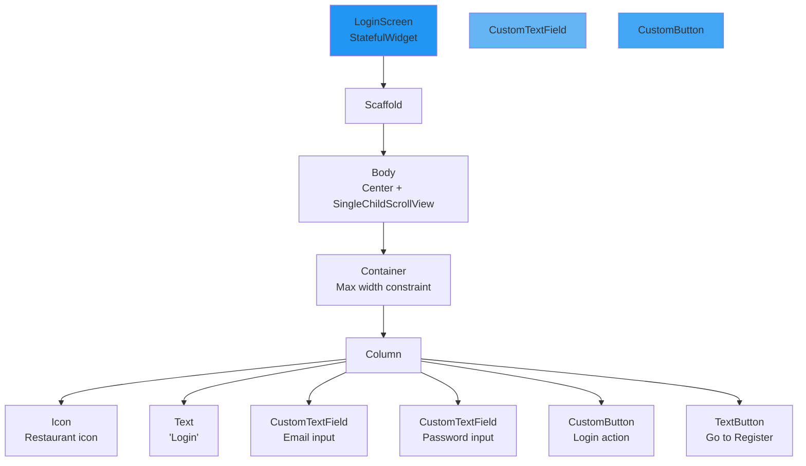

### UserHomeScreen Widget Tree

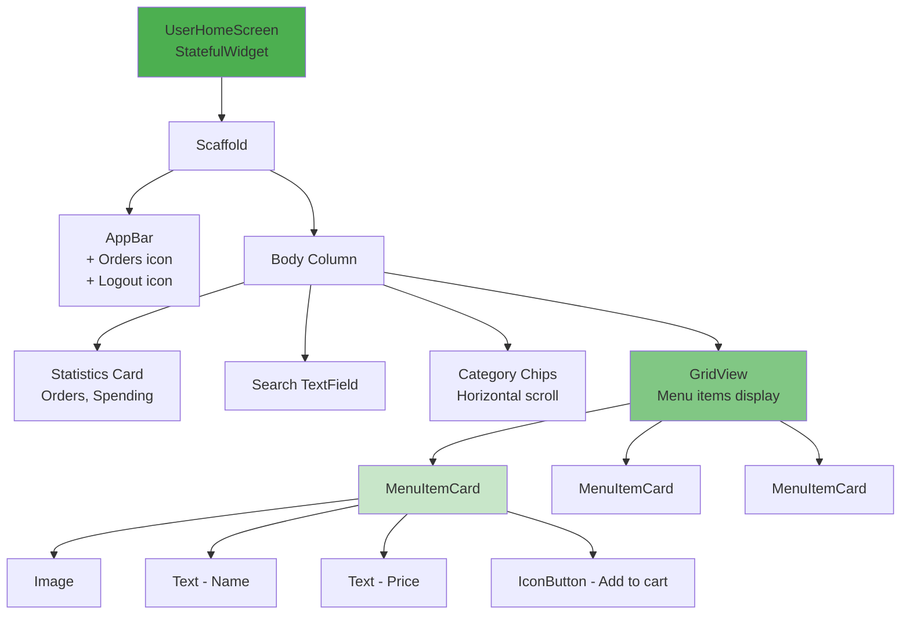

### AdminHomeScreen Widget Tree

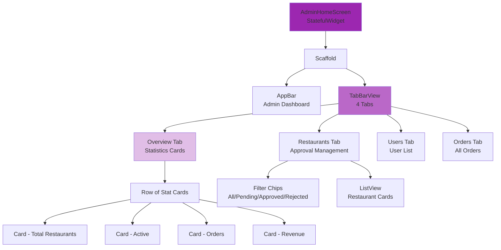

---

## 🔌 API Service Architecture

### ApiService Class Structure

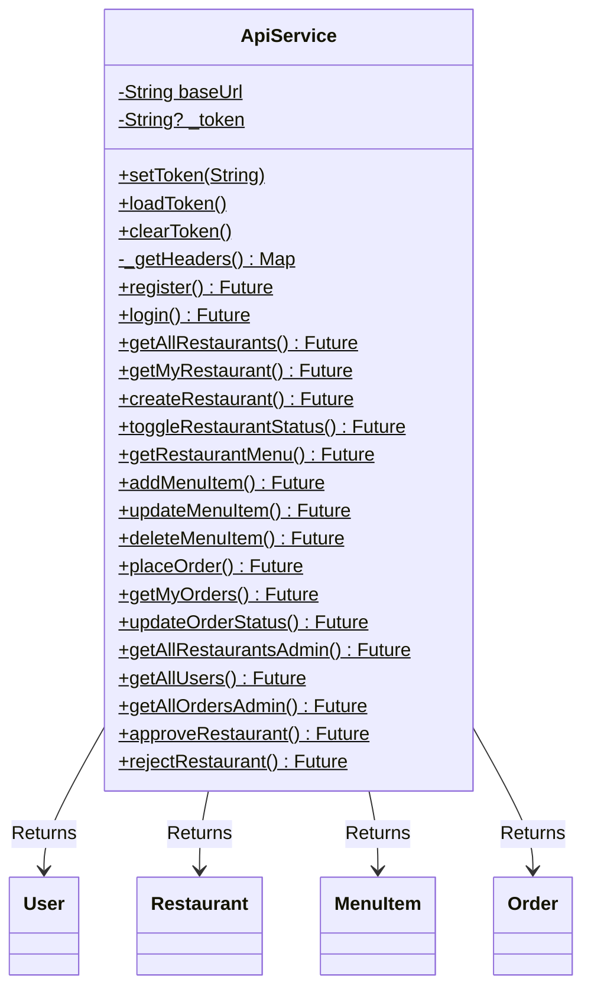

### API Endpoints Used

| Category | Method | Endpoint | Purpose |
|----------|--------|----------|---------|
| **Auth** | POST | `/api/auth/register` | Create new account |
| | POST | `/api/auth/login` | User login |
| **Restaurants** | GET | `/api/restaurants` | List all restaurants |
| | GET | `/api/restaurants/my-restaurant` | Get owner's restaurant |
| | POST | `/api/restaurants` | Create restaurant |
| | PATCH | `/api/restaurants/toggle-status` | Open/Close restaurant |
| **Menu** | GET | `/api/menus/restaurant/:id` | Get restaurant menu |
| | POST | `/api/menus` | Add menu item |
| | PUT | `/api/menus/:id` | Update menu item |
| | DELETE | `/api/menus/:id` | Delete menu item |
| **Orders** | POST | `/api/orders` | Place order |
| | GET | `/api/orders/my-orders` | Get user orders |
| | GET | `/api/orders/restaurant-orders` | Get restaurant orders |
| | PATCH | `/api/orders/:id/status` | Update order status |
| **Admin** | GET | `/api/admin/restaurants` | All restaurants |
| | GET | `/api/admin/users` | All users |
| | GET | `/api/admin/orders` | All orders |
| | POST | `/api/admin/restaurants/:id/approve` | Approve restaurant |
| | POST | `/api/admin/restaurants/:id/reject` | Reject restaurant |

---

## 💾 State Management

### Local State (setState)

The app uses simple Flutter state management with `setState()`:

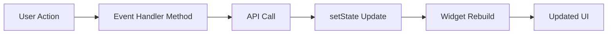

**Example:**
```dart
void _loadRestaurants() async {
  setState(() => _isLoading = true);  // Show loading
  
  final restaurants = await ApiService.getAllRestaurants();
  
  setState(() {
    _restaurants = restaurants;      // Update data
    _isLoading = false;             // Hide loading
  });
}
```

### Persistent State (SharedPreferences)

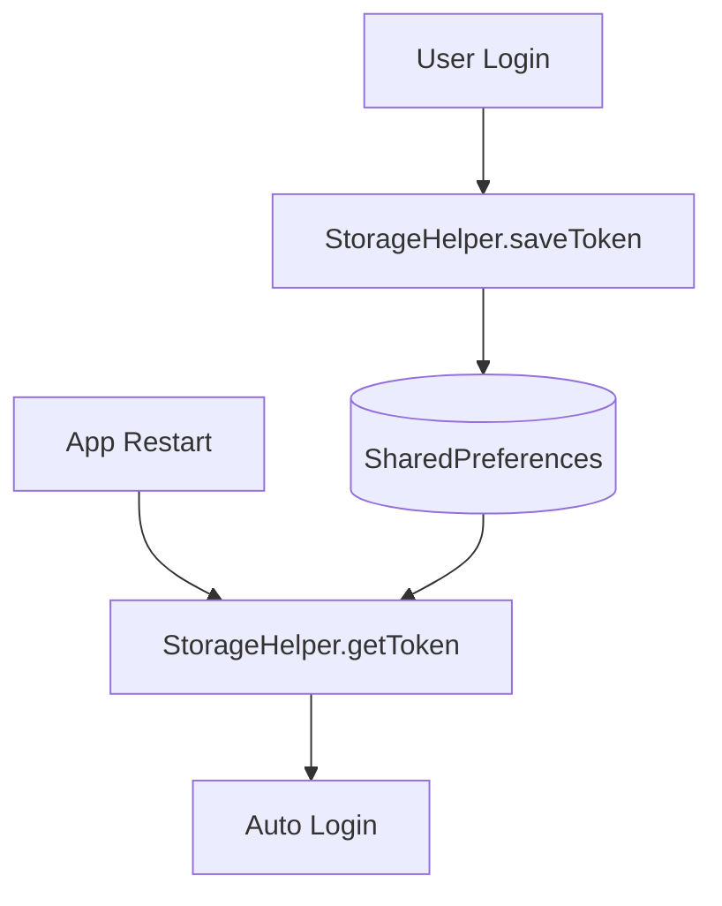

---

## 🎭 Role-Based Navigation

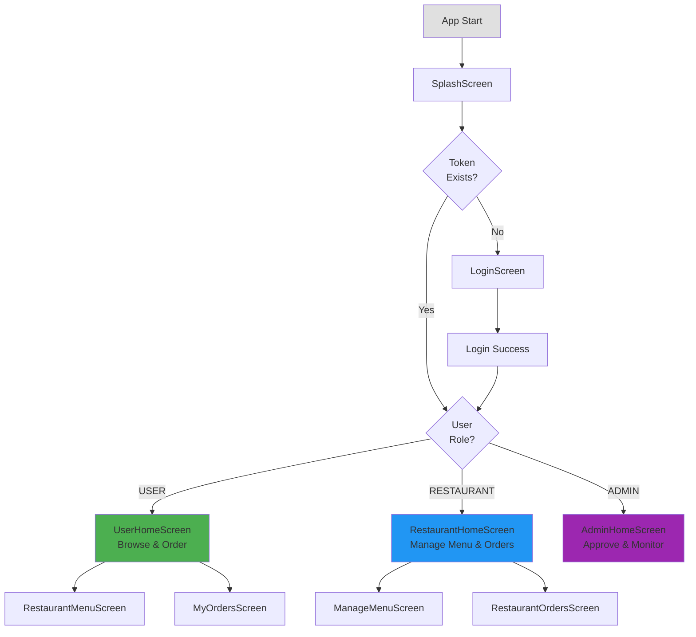

---

## 🔒 Authentication & Security

### Token Management

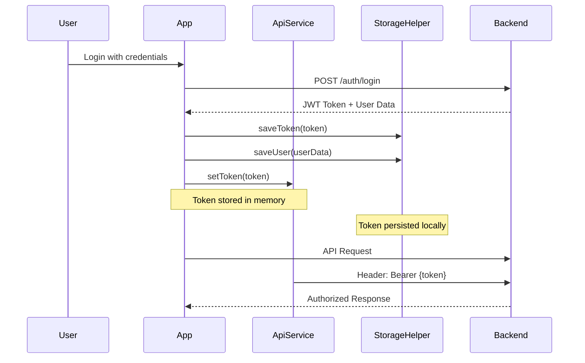

### Session Persistence

1. **On Login**: Token saved to SharedPreferences + memory
2. **On App Restart**: Token loaded from SharedPreferences
3. **On API Call**: Token attached to Authorization header
4. **On Logout**: Token cleared from both locations

---

## 📦 Dependencies

### Core Flutter Packages

```yaml
dependencies:
  flutter:
    sdk: flutter
  
  # HTTP Client for API calls
  http: ^1.1.0
  
  # Local storage for session persistence
  shared_preferences: ^2.2.2
```

### Why These Packages?

- **http**: Simple REST API communication
- **shared_preferences**: Persistent key-value storage for tokens

---

## 🎯 Key Features by Role

### 👤 User (Customer)

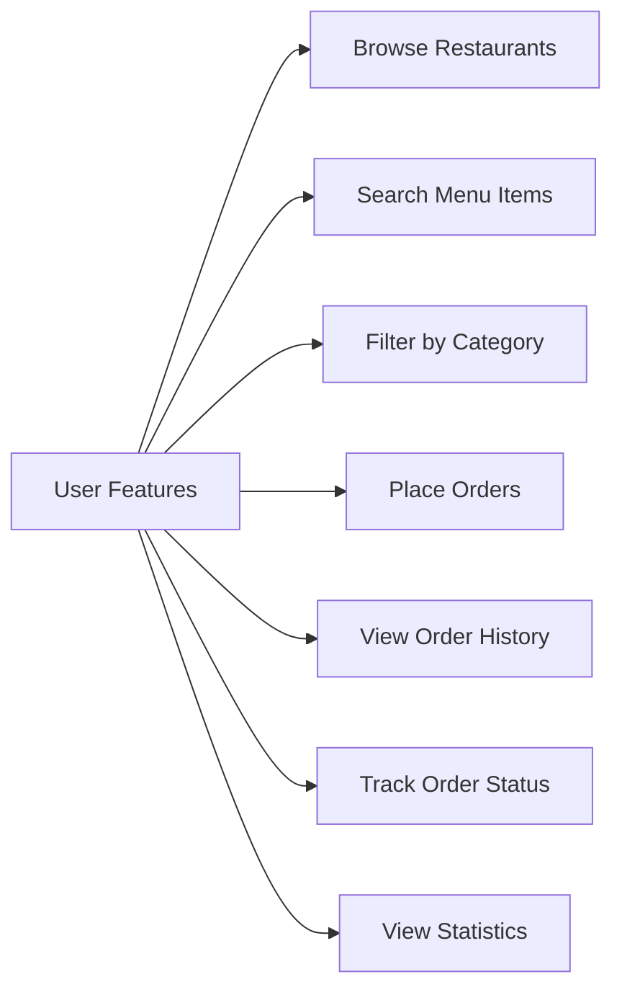

**Screens:**
- `UserHomeScreen`: Browse all menu items with search/filter
- `RestaurantMenuScreen`: View specific restaurant menu
- `MyOrdersScreen`: Order history and tracking

### 🍽️ Restaurant Owner

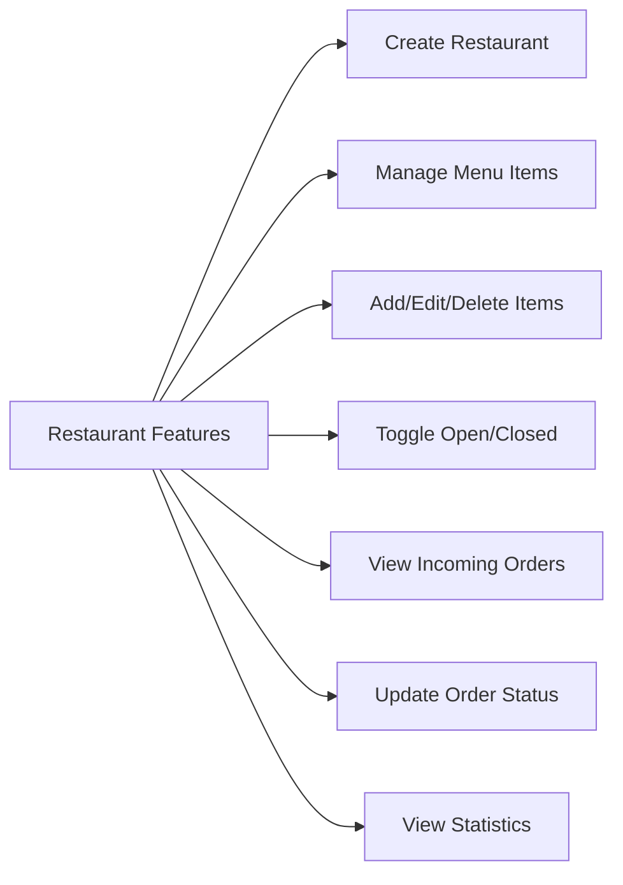

**Screens:**
- `RestaurantHomeScreen`: Dashboard with stats
- `ManageMenuScreen`: CRUD operations for menu
- `RestaurantOrdersScreen`: Order management

### 👨‍💼 Admin

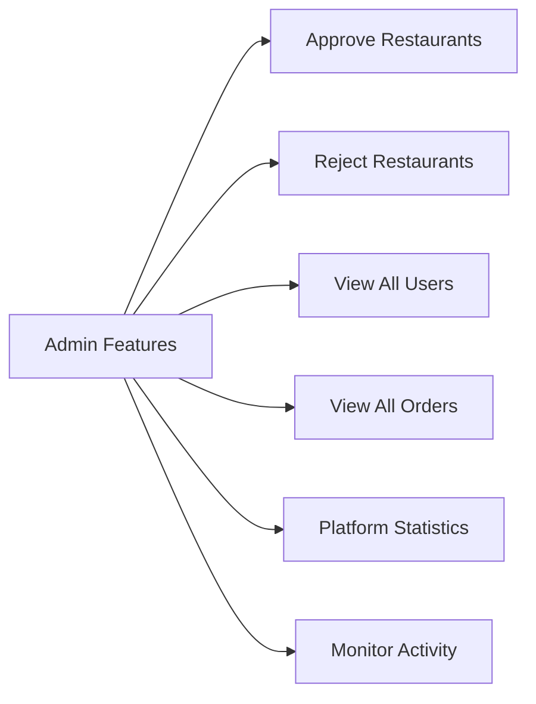

**Screens:**
- `AdminHomeScreen`: Complete dashboard with tabs
  - Overview: Platform statistics
  - Restaurants: Approval management
  - Users: User list
  - Orders: All orders monitoring

---

## 🎨 Design Patterns Used

### 1. **Model-View Pattern**
- **Models**: Data classes (User, Restaurant, Order)
- **Views**: Screen widgets
- **Service Layer**: ApiService for business logic

### 2. **Singleton Pattern**
- `ApiService`: Static methods, shared token

### 3. **Factory Pattern**
- Model classes use factory constructors for JSON parsing
```dart
factory User.fromJson(Map<String, dynamic> json) { ... }
```

### 4. **Repository Pattern**
- `StorageHelper`: Abstraction for local storage
- `ApiService`: Abstraction for remote data

---

## 🚀 Getting Started

### Prerequisites
- Flutter SDK (latest stable)
- Dart SDK
- Web browser or mobile emulator

### Installation

```bash
# Navigate to frontend directory
cd frontend

# Install dependencies
flutter pub get

# Run on Chrome
flutter run -d chrome

# Or run on mobile emulator
flutter run
```

### Configuration

Update backend URL in [api_service.dart](lib/services/api_service.dart):

```dart
static const String baseUrl = 'http://localhost:5001/api';
```

---

## 📱 Screen Flow Diagram

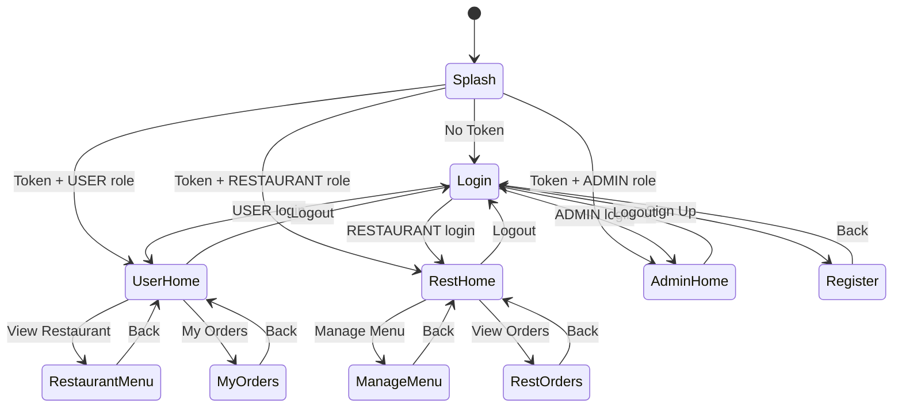

---

## 🔍 Code Organization Principles

### 1. **Separation of Concerns**
- **UI**: Screen widgets only handle display
- **Logic**: Services handle business logic
- **Data**: Models represent data structures
- **Storage**: Utils handle persistence

### 2. **Reusability**
- Custom widgets (CustomButton, CustomTextField)
- Shared constants (AppConstants, AppColors)
- Centralized API service

### 3. **Consistency**
- All screens follow similar structure
- Consistent naming conventions
- Standard error handling patterns

---

## 📊 Performance Considerations

### Optimization Strategies

1. **Efficient Widget Building**
   - Use `const` constructors where possible
   - Avoid rebuilding entire trees

2. **API Call Optimization**
   - Load data only when needed
   - Cache responses in state when appropriate

3. **Image Loading**
   - Use placeholder images
   - Network image caching by Flutter

---

## 🐛 Error Handling

### Error Handling Pattern

```dart
try {
  final response = await ApiService.someCall();
  
  if (response['success'] == true) {
    // Handle success
  } else {
    _showMessage(response['message'], isError: true);
  }
} catch (e) {
  _showMessage('Error: $e', isError: true);
}
```

### User Feedback

- **Success**: Green SnackBar
- **Error**: Red SnackBar
- **Loading**: CircularProgressIndicator

---

## 📝 Comments Style Guide

All code follows simple, clear commenting:

```dart
// Brief description of what this does
// Explains the "why" not just the "what"
```

**Examples:**
- `// Save token to local storage for next app launch`
- `// Check if restaurant is open before allowing orders`
- `// Filter menu items based on search query and category`

---

## 🔄 Future Enhancements

Potential improvements:

1. **State Management**: Implement Provider or Riverpod
2. **Offline Support**: Add offline caching with SQLite
3. **Real-time Updates**: WebSocket for live order updates
4. **Image Upload**: Camera/gallery integration
5. **Push Notifications**: Order status notifications
6. **Payment Integration**: Actual payment gateway
7. **Map Integration**: Restaurant location on map

---

## 📚 Additional Resources

- [Flutter Documentation](https://docs.flutter.dev/)
- [Dart Language Tour](https://dart.dev/guides/language/language-tour)
- [Material Design Guidelines](https://material.io/design)

---

## 👥 Authors

Ashlin, Roshni, Prabodh, Jeevan

**Last Updated**: February 2026  
**Version**: 1.0.0  
**Author**: Food Order App Team
