# 🎨 Visual Widget Diagrams - Complete Reference

This document contains all the visual widget trees and component breakdowns for the Flutter frontend.

---

## 🏗️ App Root Structure

### MyApp → MaterialApp Hierarchy

```mermaid
graph TD
    main[main.dart<br/>void main]
    main --> runApp[runApp]
    runApp --> MyApp[MyApp<br/>StatelessWidget]
    
    MyApp --> MaterialApp
    
    MaterialApp --> Title[title: 'Food Order App']
    MaterialApp --> Theme[theme: ThemeData<br/>Orange color scheme]
    MaterialApp --> InitRoute[initialRoute: '/']
    MaterialApp --> OnGenerate[onGenerateRoute<br/>Dynamic routing]
    
    OnGenerate --> Routes[Route Handler]
    
    Routes --> Route1[/ → SplashScreen]
    Routes --> Route2[/login → LoginScreen]
    Routes --> Route3[/register → RegisterScreen]
    Routes --> Route4[/user-home → UserHomeScreen]
    Routes --> Route5[/restaurant-home → RestaurantHomeScreen]
    Routes --> Route6[/admin-home → AdminHomeScreen]
    Routes --> Route7[/restaurant-menu → RestaurantMenuScreen]
    Routes --> Route8[/my-orders → MyOrdersScreen]
    Routes --> Route9[/manage-menu → ManageMenuScreen]
    Routes --> Route10[/restaurant-orders → RestaurantOrdersScreen]
    
    style MyApp fill:#ff9800
    style MaterialApp fill:#ffb74d
    style Routes fill:#ffe0b2
```

---

## 📱 Screen Widget Trees

### 1. SplashScreen Widget Tree


---

### 2. LoginScreen Widget Tree

```mermaid
graph TD
    Login[LoginScreen<br/>StatefulWidget]
    Login --> LoginState[_LoginScreenState]
    
    LoginState --> Controllers[Controllers<br/>_emailController<br/>_passwordController]
    LoginState --> StateVar[State Variables<br/>_isLoading: bool]
    
    LoginState --> BuildMethod[build method]
    BuildMethod --> Scaffold2[Scaffold<br/>backgroundColor: grey]
    
    Scaffold2 --> Body2[body: Center]
    Body2 --> Scroll[SingleChildScrollView<br/>padding: 24]
    Scroll --> Container2[Container<br/>maxWidth: 400]
    
    Container2 --> Column2[Column<br/>mainAxisAlignment: center]
    
    Column2 --> Icon2[Icon<br/>restaurant_menu<br/>size: 80<br/>color: orange]
    Column2 --> Box1[SizedBox height: 24]
    Column2 --> Title2[Text<br/>'Login'<br/>fontSize: 32<br/>bold]
    Column2 --> Box2[SizedBox height: 32]
    Column2 --> EmailField[CustomTextField<br/>label: 'Email'<br/>controller: _emailController<br/>keyboardType: email]
    Column2 --> Box3[SizedBox height: 16]
    Column2 --> PassField[CustomTextField<br/>label: 'Password'<br/>controller: _passwordController<br/>obscureText: true]
    Column2 --> Box4[SizedBox height: 24]
    Column2 --> LoginBtn[CustomButton<br/>text: 'Login'<br/>onPressed: _handleLogin<br/>isLoading: _isLoading]
    Column2 --> Box5[SizedBox height: 16]
    Column2 --> RegRow[Row<br/>"Don't have account?" + TextButton]
    
    LoginBtn -.->|onClick| HandleLogin[_handleLogin method]
    HandleLogin -.-> ApiCall[ApiService.login]
    ApiCall -.-> SaveData[StorageHelper.saveToken<br/>StorageHelper.saveUser]
    SaveData -.-> NavByRole[Navigate based on role]
    
    style Login fill:#2196f3
    style LoginState fill:#64b5f6
    style Scaffold2 fill:#bbdefb
```

---

### 3. UserHomeScreen Widget Tree

```mermaid
graph TD
    UserHome[UserHomeScreen<br/>StatefulWidget]
    UserHome --> UserState[_UserHomeScreenState]
    
    UserState --> StateVars[State Variables<br/>_restaurants: List<br/>_allMenuItems: List<br/>_filteredMenuItems: List<br/>_isLoading: bool<br/>_searchQuery: string<br/>_selectedCategory: string]
    
    UserState --> InitState2[initState<br/>_loadData<br/>_loadStats]
    UserState --> BuildMethod2[build method]
    
    BuildMethod2 --> Scaffold3[Scaffold<br/>backgroundColor: grey]
    
    Scaffold3 --> AppBar3[AppBar<br/>title: 'Order Food'<br/>backgroundColor: orange]
    Scaffold3 --> Body3[body: Column or Loading]
    
    AppBar3 --> Actions1[actions]
    Actions1 --> OrdersIcon[IconButton<br/>receipt_long<br/>→ /my-orders]
    Actions1 --> LogoutIcon[IconButton<br/>logout<br/>→ _logout]
    
    Body3 --> Loading2{_isLoading?}
    Loading2 -->|Yes| Spinner[CircularProgressIndicator]
    Loading2 -->|No| MainColumn[Column]
    
    MainColumn --> StatsCard[Statistics Card<br/>Container with gradient]
    MainColumn --> SearchBar[Search TextField<br/>Container padding: 16]
    MainColumn --> CategoryRow[Category Filter<br/>SingleChildScrollView horizontal]
    MainColumn --> MenuGrid[Expanded<br/>GridView.builder]
    
    StatsCard --> StatsContent[Column<br/>2 Rows of stats]
    StatsContent --> Row1[Row<br/>Total Orders | Delivered]
    StatsContent --> Row2[Row<br/>This Month | Total Spent]
    
    SearchBar --> TextField1[TextField<br/>hintText: 'Search for dishes'<br/>prefixIcon: search<br/>onChanged: _onSearchChanged]
    
    CategoryRow --> Chips[Wrap<br/>FilterChip widgets]
    Chips --> AllChip[FilterChip 'All']
    Chips --> FastFood[FilterChip 'Fast Food']
    Chips --> Beverages[FilterChip 'Beverages']
    Chips --> Etc[FilterChip '...more categories']
    
    MenuGrid --> ItemCards[MenuItemCard widgets<br/>for each filtered item]
    
    ItemCards --> CardStructure[MenuItemCard]
    
    style UserHome fill:#4caf50
    style UserState fill:#81c784
    style Scaffold3 fill:#c8e6c9
```

---

### 4. MenuItemCard Widget (Reusable Component)

```mermaid
graph TD
    Card[MenuItemCard<br/>StatelessWidget]
    Card --> Props[Properties<br/>MenuItem item<br/>VoidCallback onTap]
    
    Card --> BuildCard[build method]
    BuildCard --> GestureDetector[GestureDetector<br/>onTap: onTap]
    
    GestureDetector --> CardWidget[Card<br/>elevation: 2<br/>margin: 8]
    
    CardWidget --> Column3[Column<br/>crossAxisAlignment: stretch]
    
    Column3 --> ImageSection[Image Section]
    Column3 --> ContentSection[Content Padding]
    
    ImageSection --> ClipRRect[ClipRRect<br/>borderRadius: top]
    ClipRRect --> Image1[Image.network<br/>item.image<br/>height: 150<br/>fit: cover]
    
    ContentSection --> Padding1[Padding: 12]
    Padding1 --> NameText[Text<br/>item.name<br/>fontSize: 16<br/>bold]
    Padding1 --> Box6[SizedBox height: 4]
    Padding1 --> DescText[Text<br/>item.description<br/>fontSize: 12<br/>maxLines: 2<br/>overflow: ellipsis]
    Padding1 --> Box7[SizedBox height: 8]
    Padding1 --> BottomRow[Row<br/>mainAxisAlignment: spaceBetween]
    
    BottomRow --> PriceRow[Row - Price + Veg indicator]
    BottomRow --> AddButton[IconButton<br/>add_circle<br/>color: orange]
    
    PriceRow --> PriceText[Text<br/>'₹${item.price}'<br/>fontSize: 16<br/>bold]
    PriceRow --> VegIcon[Icon<br/>circle<br/>size: 12<br/>green/red]
    
    style Card fill:#ff9800
    style CardWidget fill:#ffb74d
    style Column3 fill:#ffe0b2
```

---

### 5. RestaurantHomeScreen Widget Tree

```mermaid
graph TD
    RestHome[RestaurantHomeScreen<br/>StatefulWidget]
    RestHome --> RestState[_RestaurantHomeScreenState]
    
    RestState --> StateVars2[State Variables<br/>_restaurant: Restaurant?<br/>_isLoading: bool<br/>_stats: Map]
    
    RestState --> Init3[initState<br/>_loadRestaurant<br/>_loadStats]
    RestState --> Build3[build method]
    
    Build3 --> Scaffold4[Scaffold<br/>backgroundColor: grey]
    
    Scaffold4 --> AppBar4[AppBar<br/>'Restaurant Dashboard'<br/>backgroundColor: blue]
    Scaffold4 --> Body4[body]
    
    AppBar4 --> Actions2[actions]
    Actions2 --> MenuAction[IconButton<br/>restaurant_menu<br/>→ /manage-menu]
    Actions2 --> OrdersAction[IconButton<br/>receipt<br/>→ /restaurant-orders]
    Actions2 --> LogoutAction[IconButton logout]
    
    Body4 --> Loading3{_isLoading?}
    Loading3 -->|Yes| Spinner2[CircularProgressIndicator]
    Loading3 -->|No| MainContent[RefreshIndicator<br/>SingleChildScrollView]
    
    MainContent --> Padding2[Padding: 16]
    Padding2 --> Column4[Column<br/>crossAxisAlignment: stretch]
    
    Column4 --> RestInfo[Restaurant Info Card]
    Column4 --> Box8[SizedBox height: 16]
    Column4 --> StatsGrid[Stats Grid]
    Column4 --> Box9[SizedBox height: 16]
    Column4 --> QuickActions[Quick Action Buttons]
    
    RestInfo --> Card1[Card]
    Card1 --> ListTile[ListTile<br/>title: restaurant.name<br/>subtitle: address<br/>trailing: Status Switch]
    
    StatsGrid --> GridView1[GridView.count<br/>crossAxisCount: 2<br/>4 stat cards]
    GridView1 --> StatCard1[Stat Card<br/>Total Orders]
    GridView1 --> StatCard2[Stat Card<br/>Pending Orders]
    GridView1 --> StatCard3[Stat Card<br/>Today's Revenue]
    GridView1 --> StatCard4[Stat Card<br/>Total Revenue]
    
    QuickActions --> Row3[Row<br/>2 expanded buttons]
    Row3 --> ManageBtn[ElevatedButton<br/>'Manage Menu']
    Row3 --> ViewBtn[ElevatedButton<br/>'View Orders']
    
    style RestHome fill:#2196f3
    style RestState fill:#64b5f6
    style Scaffold4 fill:#bbdefb
```



---

### 6. AdminHomeScreen Widget Tree


---

## 🧩 Reusable Widget Components

### CustomButton Widget


### CustomTextField Widget


---

## 🎯 Widget Composition Examples

### Example: Order Dialog Composition

```mermaid
graph TD
    OrderDialog[_OrderDialog<br/>StatefulWidget]
    OrderDialog --> DialogState[State<br/>_quantity: int = 1]
    
    DialogState --> Build7[build method]
    Build7 --> AlertDialog1[AlertDialog]
    
    AlertDialog1 --> Title3[title: Text<br/>'Place Order']
    AlertDialog1 --> Content1[content: Column]
    AlertDialog1 --> Actions4[actions: List]
    
    Content1 --> ItemName[Text<br/>item.name<br/>fontSize: 18<br/>bold]
    Content1 --> Box10[SizedBox height: 8]
    Content1 --> ItemPrice[Text<br/>'₹${item.price}'<br/>fontSize: 16]
    Content1 --> Box11[SizedBox height: 16]
    Content1 --> QtyRow[Row<br/>Quantity selector]
    Content1 --> Box12[SizedBox height: 16]
    Content1 --> TotalRow[Row<br/>Total amount]
    
    QtyRow --> MinusBtn[IconButton<br/>remove_circle<br/>onPressed: decrease]
    QtyRow --> QtyText[Text<br/>_quantity<br/>fontSize: 18]
    QtyRow --> PlusBtn[IconButton<br/>add_circle<br/>onPressed: increase]
    
    TotalRow --> TotalLabel[Text 'Total:']
    TotalRow --> TotalAmount[Text<br/>'₹${item.price * _quantity}'<br/>bold]
    
    Actions4 --> CancelBtn[TextButton<br/>'Cancel'<br/>pop false]
    Actions4 --> PlaceBtn[ElevatedButton<br/>'Place Order'<br/>_placeOrder]
    
    PlaceBtn -.-> ApiCall2[ApiService.placeOrder]
    ApiCall2 -.-> Success[onOrderPlaced callback]
    Success -.-> Close[Navigator.pop]
    
    style OrderDialog fill:#4caf50
    style AlertDialog1 fill:#81c784
```

---

## 🎨 Theme & Styling Structure

### App Theme Configuration


### AppColors Constants


---

## 📐 Layout Patterns

### Common Layout Pattern 1: Card Grid


### Common Layout Pattern 2: List View


---

## 🔄 State Management Pattern

### setState Pattern Used


---

## 📱 Navigation Flow Diagram

### Complete Navigation Map


---

This comprehensive visual guide shows every widget tree structure in the Flutter app! 🎨
